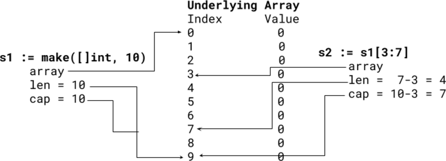

## 一个简单的追加

```go
package main

import (
    "fmt"
)

func main() {
    a := []int{1, 2, 3}
    b := append(a[:1], 10)
    fmt.Printf("a=%v, b=%v  \n  ", a, b)
}
```

## 猜输出

此代码将打印：a=[1 10 3], b=[1 10]


您需要深入了解切片是如何实现的以及 append 是如何工作的，以了解您为什么要播种此输出。

如果你查看 Go 源代码中的 src/runtime/slice.go，你会看到

```go
typeslice struct {
    array unsafe.Pointer
    len   int
    cap   int
}
```

slice 是一个包含三个字段的结构体。数组是指向保存数据的底层数组的指针。 len 是切片的长度。 cap 是底层数组的容量。

这是一个插图示例：



切片符号（例如，s1[3:7]）是半开放的，意思是从第一个索引到但不包括最后一个索引。在 s2 中，您得到索引 3、4、5 和 6，这意味着长度 (len) 为 4。

容量是从切片的开头到底层数组的结尾有多少项。在 s2 中，我们从 3 开始，可以增加到 10，这意味着容量是 7。

您可以使用内置的 len 和 cap 函数检查长度和容量。 len(s2) 为 4，cap(s2) 为 7。

您可能会遗漏的下一部分是 append 的工作原理。当您调用 append 时，它会检查容量。如果有足够的空间， append 将使用附加项更改底层数组并返回一个切片，指向具有更大长度的同一个数组。如果底层数组中没有更多空间， append 将创建一个新的更大的数组，复制旧数组，用新项更新新数组，并返回一个指向新数组的切片。

这是 append 的一个可能实现：

```go
func Append(items [] int, i int) []int {
    if len(items) == cap(items) { // No more space in underlying array
        // Go has a better growth heuristic than adding 1 every append
        newItems := make([]int, len(items)+1)
        copy(newItems, items)
        items = newItems
    } else {
        items = items[:len(items)+1]
    }
    tems[len(items)-1] = i
    return items
}
```

现在您可以计算出输出。有趣的一行是 b := append(a[:1], 10)。 a[:1] 创建一个长度为 1 和容量为 3 的切片。 append 会发现有足够的空间并更改底层数组，将 10 放在索引 1 处。

a 和 b 都指向同一个底层数组。 a 的长度为 3，b 的长度为 2。这就是为什么输出是 a=[1 10 3], b=[1 10]。

## 进一步阅读

- Go 博客中的切片内部
    http://blog.golang.org/slices
- Effective Go 中的切片
    http://golang.org/doc/effective_go.html#slices
- Go Wiki 中的切片技巧
    http://github.com/golang/go/wiki/SliceTricks